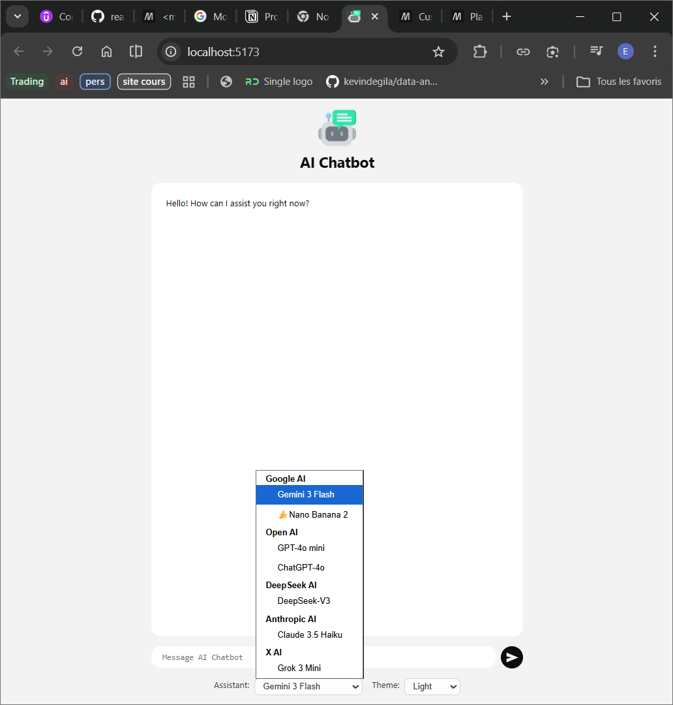
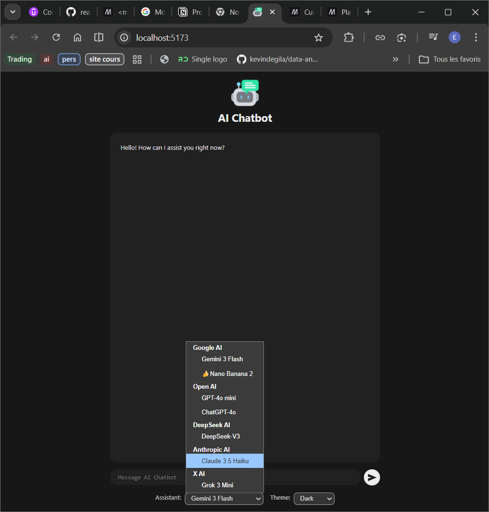

# React AI Chatbot

A modern, responsive AI chatbot application built with React and Vite. It supports multiple AI models and provides a seamless chatting experience with a clean UI.

## Features

- **Multi-LLM Support**: Seamlessly switch between different AI assistants, including:
  - Google Gemini (e.g., Gemini 3 Flash Preview)
  - OpenAI (e.g., GPT-4o)
  - Anthropic (e.g., Claude 3.5)
  - DeepSeek AI
  - xAI (Grok)
- **Real-time Streaming**: Enjoy fast, real-time responses as the AI generates them.
- **Auto-Scrolling Chat**: Automatically scrolls to the latest message.
- **Message Grouping**: Intelligently groups messages for better readability.
- **Markdown Support**: Rich text rendering for assistant replies.
- **Theme Switcher**: Supports both Light and Dark modes.

## Previews

Here is a glimpse of the application in action:

### Light Mode


### Dark Mode


## Getting Started

### Prerequisites

- Node.js (v18+)
- API Keys for the respective AI services you want to use.

### Installation

1. Clone the repository:
   ```bash
   git clone https://github.com/exhorte/react-chatbot.git
   cd react-chatbot
   ```

2. Install dependencies:
   ```bash
   npm install
   ```

3. Configure your API keys:
   Create a `.env.local` file in the root directory and add your keys:
   ```env
   VITE_GOGGLE_AI_API_KEY=your_google_api_key_here
   VITE_OPEN_AI_API_KEY=your_openai_api_key_here
   VITE_ANTHROPIC_API_KEY=your_anthropic_api_key_here
   VITE_DEEPSEEK_API_KEY=your_deepseek_api_key_here
   VITE_X_AI_API_KEY=your_xai_api_key_here
   ```

4. Start the development server:
   ```bash
   npm run dev
   ```

## Tech Stack

- **React** - UI framework
- **Vite** - Build tool and dev server
- **Vanilla CSS** (`.module.css`) - Styling
- **AI SDKs** - `@google/genai`, `openai`, etc.
